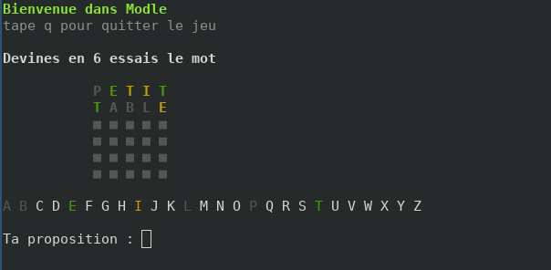

# Wordle en français: Modle 🇫🇷

La liste des mots utilisés dans le jeu a été créée avec l'aide du site Web [OpenLexicon](https://chrplr.github.io/openlexicon/)

inspiré du jeu Wordle : [Wordle NYTimes](https://www.nytimes.com/games/wordle/index.html)


## Installation
1. Cloner le repository
```bash
git clone git@github.com:Camille-cmd/modle.git
```

2. Installer le pipenv (`pipenv install`) et ouvrir un shell pipenv (`pipenv shell`)

> autre solution: vous pouvez simplement installer la librairie colorama : `pip3 install colorama`

3. Lancer le jeu:
```bash
python3 game.py
```

## Comment jouer

Vous avez __6 essais__ pour deviner le mot.

Chaque proposition doit être un __mot de 5 lettres valide__.

Après avoir appuyé sur Entrée, le mot sera ajouté à la grille et chaque lettre sera affichée dans une couleur qui montre si
vous êtes proche du mot à deviner.



Lorsqu'une lettre est à la __position correcte__ dans le mot, elle s'affiche en __vert__.

Lorsqu'une lettre est __dans le mot mais pas à la bonne position__, elle s'affiche en __jaune__.

Lorsqu'une lettre n'est __pas dans le mot__, elle s'affiche en __gris__.

__Le jeu se termine__ lorsque vous avez deviné le mot correct ou si vous n'avez plus d'essais.

En cas de victoire, vous aurez la possibilité de copier le resultat de votre tour dans le presse-papier. Vous pourrez ensuite le coller où vous voulez (dans un message à un ami par exemple) pour partager votre score.

> Dans certains cas, cette fonctionnalité peut ne pas fonctionner. Le resultat sera alors affiché en console et vous pourrez le copier manuellement. 

```
Modle 3/6
⬛🟩🟨🟨🟩
🟩⬛⬛⬛🟨
🟩🟩🟩🟩🟩
```

## License
Voir [LICENSE.md](LICENSE.md)

Copyright (c) [2022][camille-cmd]


